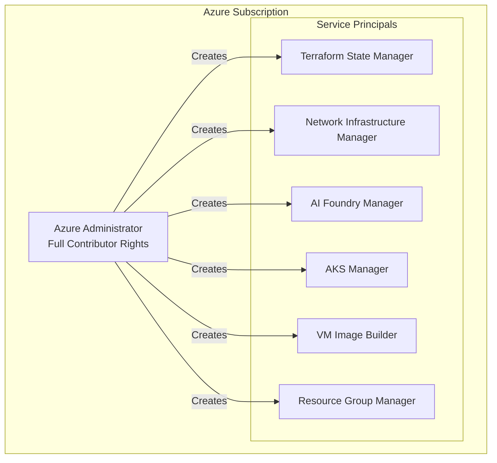
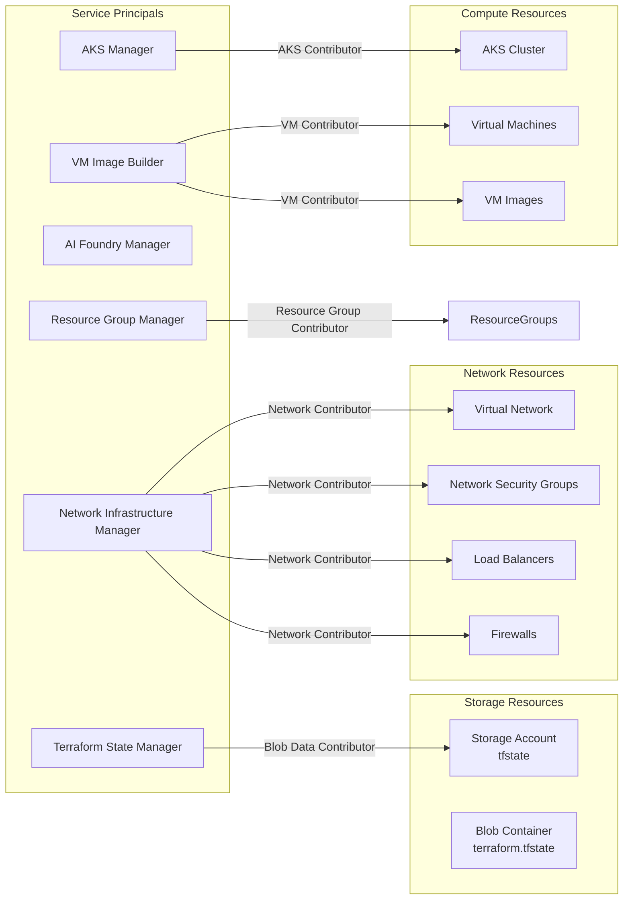
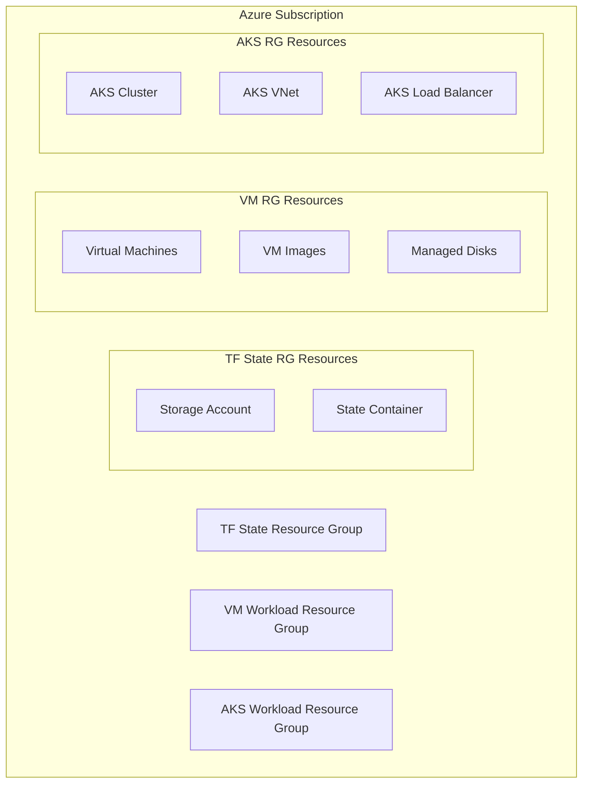
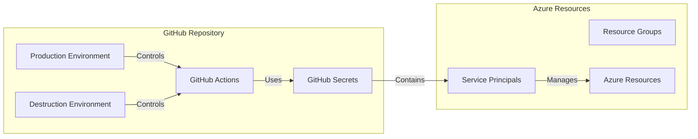
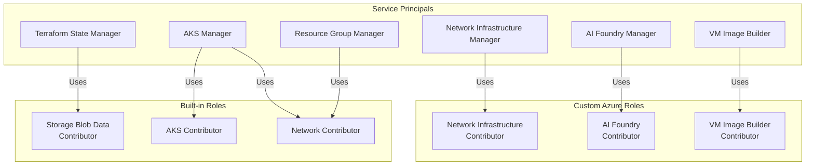
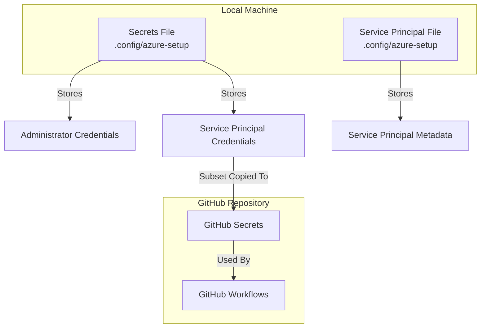

# Azure Infrastructure and Service Principal Architecture

## Service Principal Hierarchy

## Resource Access and Permissions

## Resource Groups and Scoping

## GitHub Integration

## Custom Role Definitions

## Security Storage
